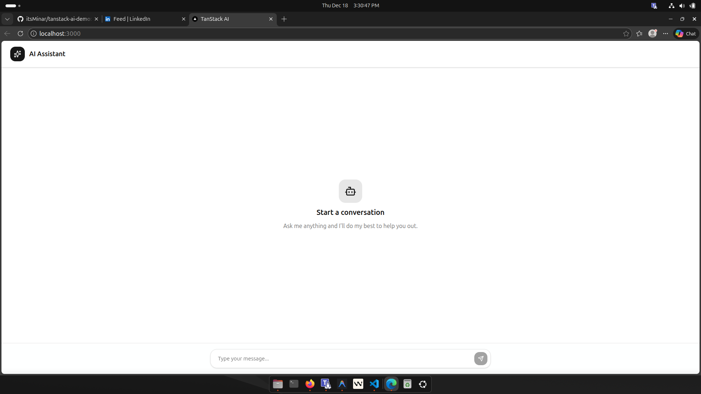

This is a [Next.js](https://nextjs.org) project bootstrapped with [`create-next-app`](https://nextjs.org/docs/app/api-reference/cli/create-next-app).

## Getting Started

First, run the development server:

```bash
npm run dev
# or
yarn dev
# or
pnpm dev
# or
bun dev
```

Open [http://localhost:3000](http://localhost:3000) with your browser to see the result.

You can start editing the page by modifying `app/page.tsx`. The page auto-updates as you edit the file.

This project uses [`next/font`](https://nextjs.org/docs/app/building-your-application/optimizing/fonts) to automatically optimize and load [Geist](https://vercel.com/font), a new font family for Vercel.

## Learn More

To learn more about Next.js, take a look at the following resources:

- [Next.js Documentation](https://nextjs.org/docs) - learn about Next.js features and API.
- [Learn Next.js](https://nextjs.org/learn) - an interactive Next.js tutorial.

You can check out [the Next.js GitHub repository](https://github.com/vercel/next.js) - your feedback and contributions are welcome!

## Deploy on Vercel

The easiest way to deploy your Next.js app is to use the [Vercel Platform](https://vercel.com/new?utm_medium=default-template&filter=next.js&utm_source=create-next-app&utm_campaign=create-next-app-readme) from the creators of Next.js.

Check out our [Next.js deployment documentation](https://nextjs.org/docs/app/building-your-application/deploying) for more details.

## Chat Application

This project is a chat application built using Next.js and the `@tanstack/ai-react` library. It provides a real-time chat interface with an AI assistant.

### Features

- **Real-time Messaging**: Communicate with the AI assistant in real-time.
- **Responsive Design**: Optimized for both desktop and mobile devices.
- **Customizable UI**: Built with Tailwind CSS for easy customization.

### Screenshot

Below is a screenshot of the application:



### How to Use

1. Clone the repository:

   ```bash
   git clone https://github.com/itsMinar/tanstack-ai-demo.git
   ```

2. Navigate to the project directory:

   ```bash
   cd tanstack-ai-demo
   ```

3. Install dependencies:

   ```bash
   npm install
   # or
   yarn install
   # or
   pnpm install
   # or
   bun install
   ```

4. Start the development server:

   ```bash
   npm run dev
   # or
   yarn dev
   # or
   pnpm dev
   # or
   bun dev
   ```

5. Open [http://localhost:3000](http://localhost:3000) in your browser to view the application.

### File Structure

- `src/app/page.tsx`: Main chat interface.
- `src/app/api/chat/route.ts`: API route for handling chat messages.
- `src/lib/utils.ts`: Utility functions.

### Technologies Used

- **Next.js**: React framework for building server-side rendered applications.
- **@tanstack/ai-react**: Library for AI-powered chat functionality.
- **Tailwind CSS**: Utility-first CSS framework for styling.

### License

This project is licensed under the MIT License.
